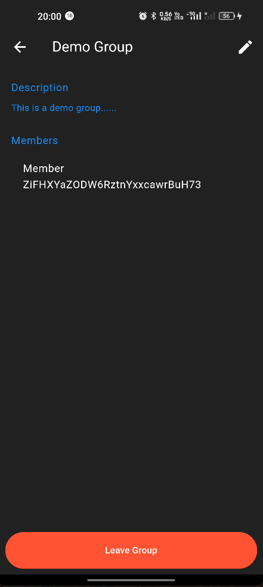

# Collaborative Study Platform
[](https://firebase.google.com/)
[](https://flutter.dev/)
[](https://dart.dev/)

A Flutter-based mobile application designed to enhance collaborative learning experiences. This platform integrates task management, quizzes, and group study features to create an engaging and interactive study environment.

## ⚡️ Features

- **User Authentication**: Secure login and registration system.
- **Task Management**: Create, update, and track study tasks with due dates.
- **Quizzes**: Create and take quizzes to test knowledge and prepare for exams.
- **Responsive UI**: Clean and intuitive user interface designed with Flutter.
- **Real-time Updates**: Utilizes Firebase for real-time data synchronization.

## Screenshots

<table>
  <tr>
    <td></td>
    <td></td>
    <td></td>
    <td></td>
  </tr>
  <tr>
    <td></td>
    <td></td>
    <td></td>
    <td></td>
  </tr>
  <tr>
    <td></td>
    <td></td>
    <td></td>
    <td></td>
  </tr>
  <tr>
    <td></td>
  </tr>
</table>

## 👩‍💻 Technologies Used

- Flutter 2.x
- Dart 2.x
- Firebase (Authentication, Firestore)
- Provider (State Management)

## 🚀 Getting Started

### Prerequisites

- Flutter SDK
- Dart SDK
- Android Studio / VS Code
- Firebase account

### Installation

1. Clone the repository:
   ```
   git clone https://github.com/SanjayKParida/collaborative-study-platform.git
   ```
2. Navigate to the project directory:
   ```
   cd collaborative-study-platform
   ```
3. Install dependencies:
   ```
   flutter pub get
   ```
4. Set up Firebase:
   - Create a new Firebase project
   - Add an Android app to your Firebase project
   - Download the `google-services.json` file and place it in the `android/app` directory
   - Add an iOS app to your Firebase project
   - Download the `GoogleService-Info.plist` file and place it in the `ios/Runner` directory
   - Enable Authentication and Firestore in your Firebase project

5. Run the app:
   ```
   flutter run
   ```

## Project Structure

```
lib/
├── config/
│   └── theme.dart
├── features/
│   ├── authentication/
│   ├── tasks/
│   ├── quizzes/
│   ├── notes/
│   ├── profile/
│   └── groups/
├── services/
│   ├── api_service.dart
│   ├── auth_service.dart
│   └── storage_service.dart
├── shared/
│   ├── models/
│   ├── widgets/
│   └── helpers/
├── firebase_options.dart
└── main.dart
```

## 🧠 Key Components

- **Authentication**: Handles user sign-up, login, and session management.
- **Tasks**: Allows users to create, edit, and manage their study tasks.
- **Quizzes**: Enables users to create quizzes and participate in quizzes created by others.
- **Groups**: (If implemented) Facilitates the creation and management of study groups.

## 🧣 Future Enhancements

- Implement group study features
- Add a chat system for real-time communication
- Integrate a calendar for better task and event management
- Implement push notifications for reminders and updates


## License

This project is licensed under the MIT License - see the [LICENSE](LICENSE) file for details.

## Contact

Sanjay Kumar Parida - [kumarparidasanjay23@gmail.com](mailto:kumarparidasanjay23@gmail.com)

Project Link: [https://github.com/SanjayKParida/collaborative-study-platform](https://github.com/SanjayKParida/collaborative-study-platform)
